# Literary Visual Card Skill

有些文字不需要被解释，只需要一个让人停下来的画面。

Literary Visual Card 把诗歌、书摘、金句、散文片段和原创短文制作成可分享的 `4:5` 文学视觉卡。你只需交出文字；技能会帮你挑选最有传播力的原文片段、确认画面意向、选择视觉风格，并完成排版与检查。

它不会擅自润色你的句子，也不会用一堆象征物把文字解释得太满。

## 四种视觉风格

四种风格共用同一套标题、正文和署名排版，但会用不同的视觉语言理解文字。

| 时光蜡笔 ·《山脚之下》 | 电影诗影 ·《不懂》 |
| --- | --- |
| [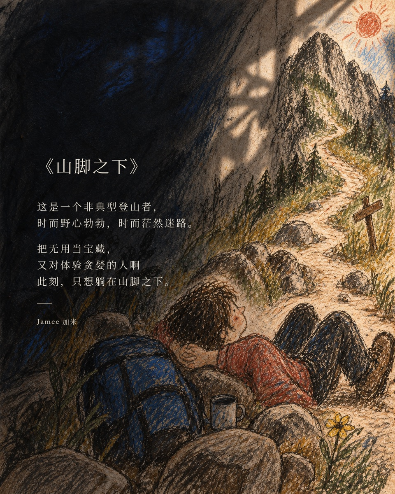](examples/foothill-crayon.jpg) | [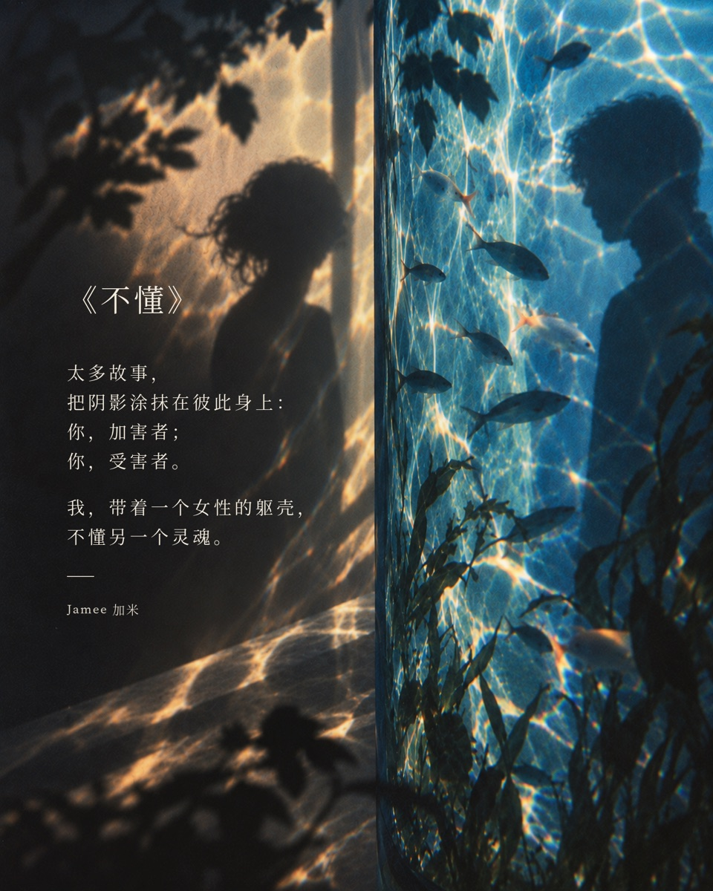](examples/not-understand-cinematic.jpg) |
| 成人世界被重新画成一幅笨拙的儿童画：蜡笔、炭笔、真实窗光，以及一点重新开始的勇气。 | 真实摄影、深蓝暖金光影与胶片颗粒，让关系、距离和记忆停留在半梦半醒之间。 |

| 旧梦丝网 ·《家族列车》 | 梵高油画 ·《凌晨谋杀一只蟑螂》 |
| --- | --- |
| [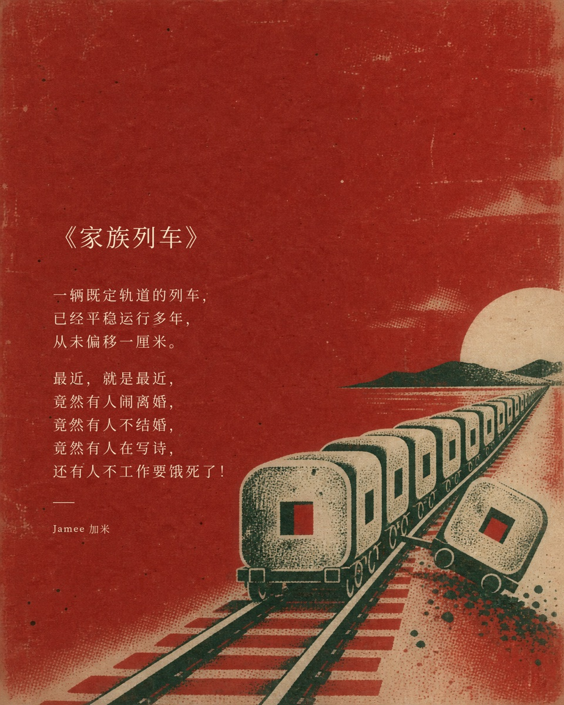](examples/family-train-screenprint.jpg) | [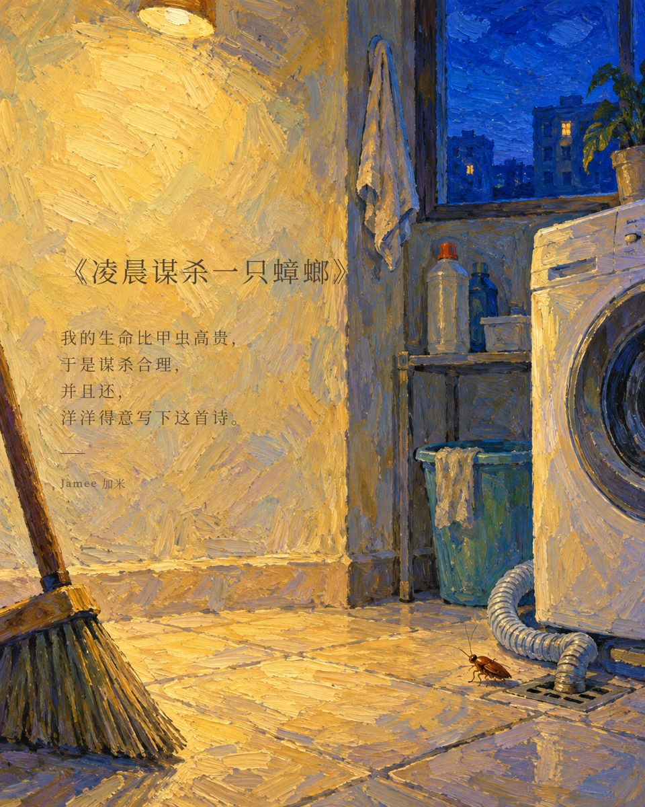](examples/cockroach-oil.jpg) |
| 现代平面构图遇上粗粝丝网印刷：有限色彩、简洁线条、纸张纤维和略带荒诞的日常物件。 | 有节奏的厚涂笔触和被情绪强化的自然色彩，适合孤独、生命力与明亮的忧伤。 |

## 完整系列示例

同一句文字也可以分别交给四种视觉语言理解。下面两套系列保留相同的标题与原文，只改变画面媒介、构图方式和色彩关系。

### 《教父》

> 我要给他一个<br>
> 无法拒绝的条件。

| 时光蜡笔 | 电影诗影 |
| --- | --- |
| [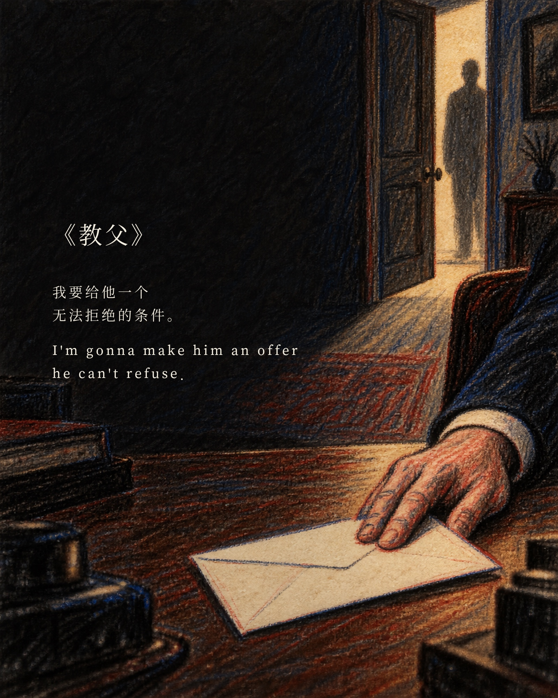](examples/godfather-crayon.jpg) | [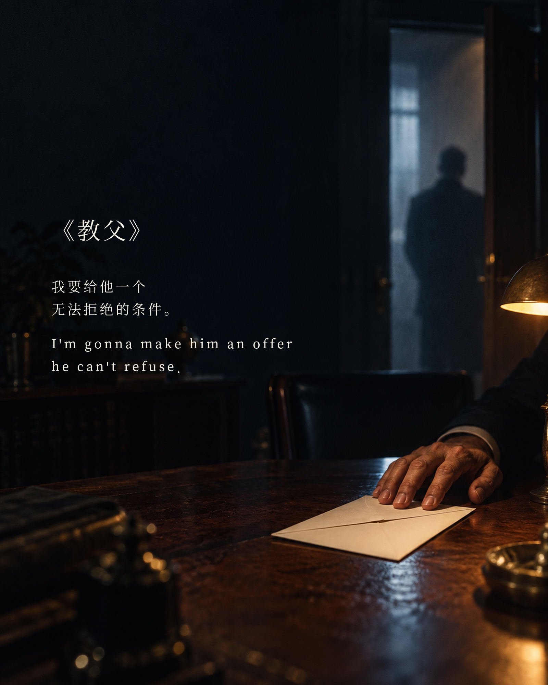](examples/godfather-cinematic.jpg) |

| 旧梦丝网 | 梵高油画 |
| --- | --- |
| [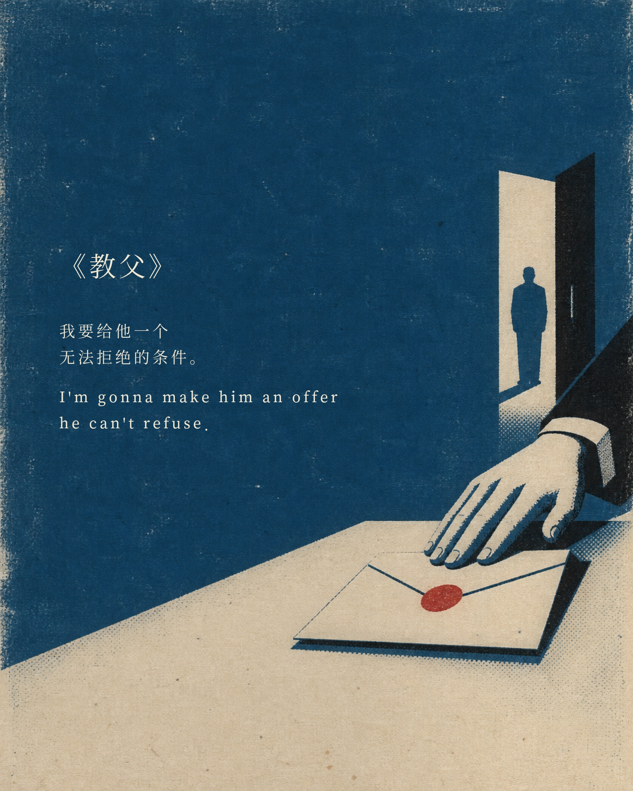](examples/godfather-screenprint.jpg) | [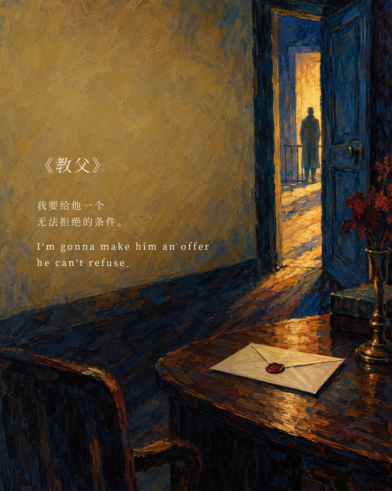](examples/godfather-oil.jpg) |

### 《英雄本色》

> 我等这个机会等了三年，不是为了证明我比别人强，而是要告诉人家我失去的东西我一定拿得回来！

| 时光蜡笔 | 电影诗影 |
| --- | --- |
| [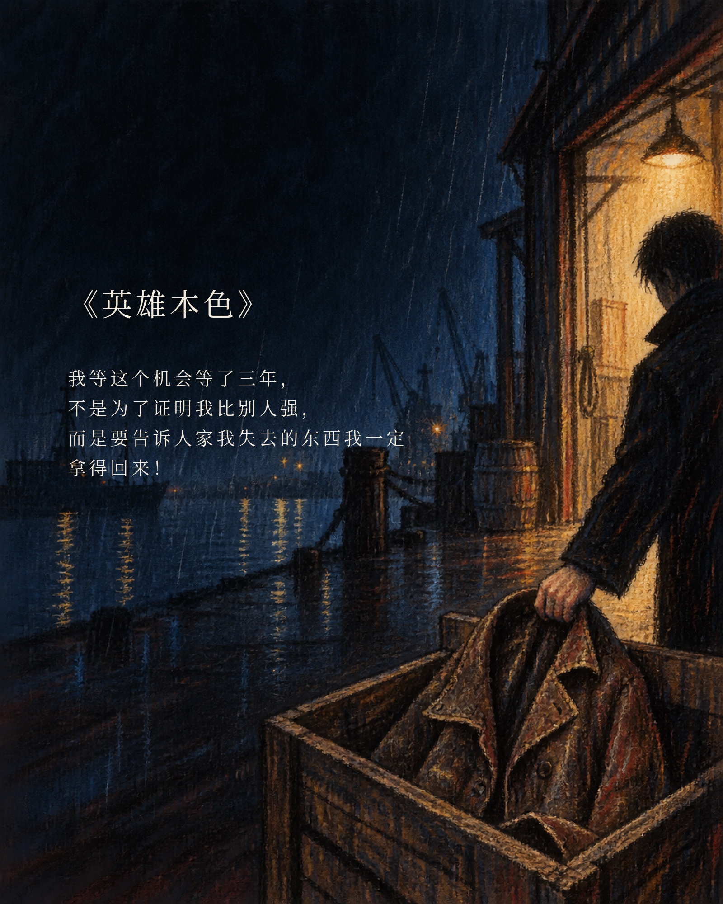](examples/better-tomorrow-crayon.jpg) | [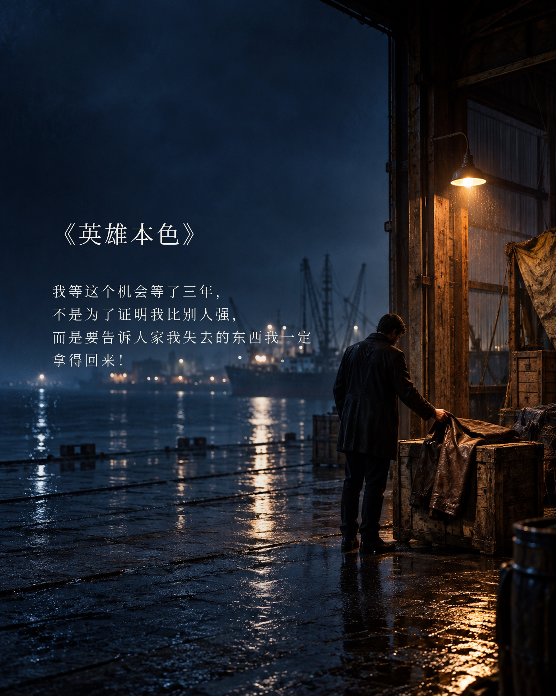](examples/better-tomorrow-cinematic.jpg) |

| 旧梦丝网 | 梵高油画 |
| --- | --- |
| [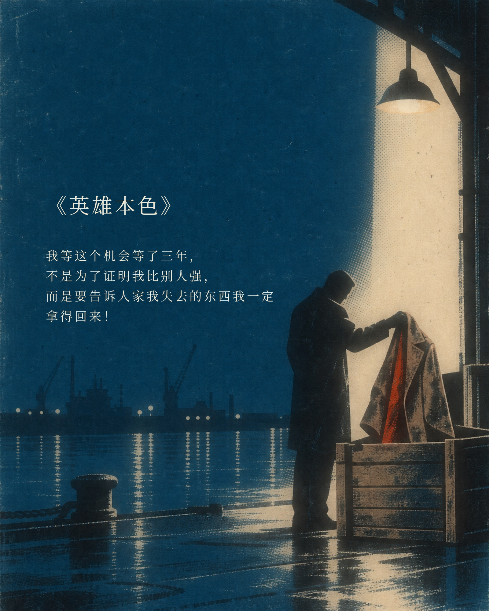](examples/better-tomorrow-screenprint.jpg) | [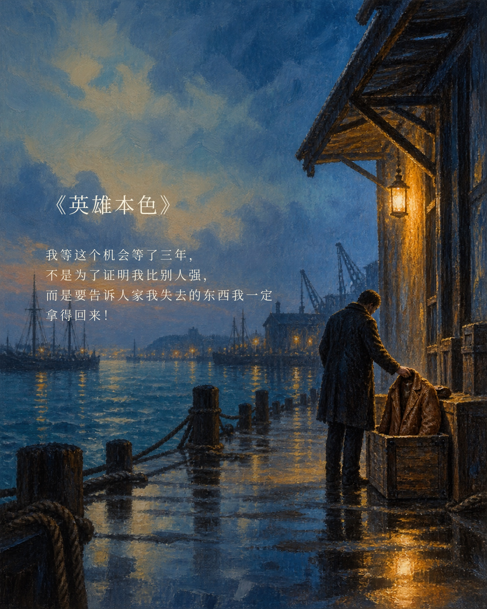](examples/better-tomorrow-oil.jpg) |

## 你需要提供什么

最简单的输入只有一段文字：

```text
$literary-visual-card

请把下面这段文字制作成视觉卡：
……
```

作者、书名和出处都是可选信息。只有你明确提供或要求显示时，卡片才会加入这些内容；无法确认的出处会直接省略，不会出现“出处待考”之类的占位符。

你也可以提前指定风格：

```text
用电影诗影制作这段文字。
```

或者把选择完全交给技能：

```text
直接做，帮我选择最适合的摘抄、意向和风格。
```

## 它会怎样与你协作

默认只有一次内容确认和一次风格选择：

1. 技能阅读完整原文，给出「摘取金句＋画面意向」。整篇文字决定画面的世界、情绪和矛盾；被摘取的金句决定一个能钉住视线的视觉焦点。
2. 你确认意向后，从时光蜡笔、电影诗影、旧梦丝网和梵高油画中选择一种。
3. 技能生成无字背景，再用固定排版器加入标题、摘抄和可选署名，最后检查尺寸、原文准确性与可读性。

如果你已经指定风格，第二步不会重复询问。说“直接做”“你来选”或“不用确认”，即可让技能自行完成选择并直接交付。

## 它会认真守住什么

- 摘抄必须来自一段连续原文，不改写、不润色，也不拼接不相邻的句子。
- 诗歌保留原有分行、标点和段落；散文只做视觉换行，不改变措辞。
- 没有标题时使用无标题版式，不擅自创造一个像原作标题的标题。
- 没有作者或出处时直接留白，不推测、不杜撰，也不自动添加署名。
- 只有气氛、没有视觉抓力的背景不算完成；文字看不清的卡片也不会交付。

## 输出

- `1600 × 2000 px`，竖版 `4:5` PNG。
- 中文使用 Source Han Serif SC Regular，拉丁字符使用 Source Serif 4 Regular。
- 无字背景、排版 JSON 和最终成品分别保存，方便只改文字而不重新出图。
- 标题、正文、署名与图片背景经过完整可读性检查。

## 安装

将仓库克隆到个人 Skills 目录：

```bash
git clone https://github.com/jameelovecat/literary-visual-card.git ~/.agents/skills/literary-visual-card
```

排版器使用 Python 3 和 Pillow。如果当前环境尚未安装 Pillow：

```bash
python3 -m pip install Pillow
```

重新打开 Codex 后，即可通过 `$literary-visual-card` 调用。使用其他支持 Skills 的客户端时，也可以将仓库放进该客户端约定的 Skills 目录。

## 项目结构

```text
literary-visual-card/
├── SKILL.md
├── README.md
├── agents/
├── assets/fonts/
├── examples/
├── references/
└── scripts/render_card.py
```

## License

技能代码与文档采用 [MIT License](LICENSE)。随仓库分发的字体文件继续遵循 `assets/fonts/` 中各自的 SIL Open Font License。
